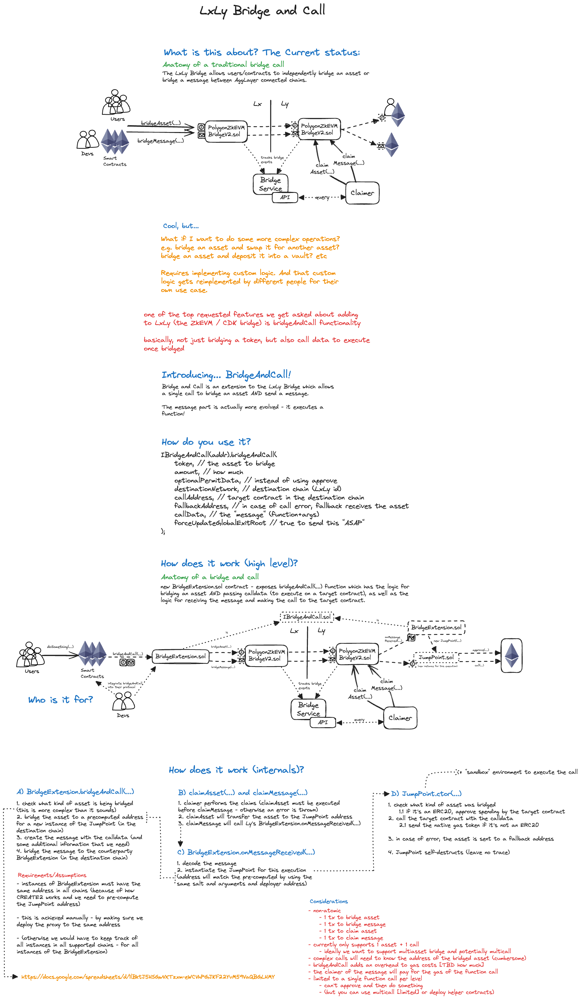

# uLXLY BRIDGE AND CALL

NOTE: Work in Progress. Unaudited.

## Testing and Deploying

First, copy `.env.example` to `.env` and set the appropriate environment variables (annotated with TODOs).

### Testing (Mainnet Forks)

1. Start anvil: two instances required, one for L1, and one for L2

```bash
# 1.1 start L1 (ethereum mainnet) anvil - NOTE: using port 8001 for L1
anvil --fork-url <https://eth-mainnet.g.alchemy.com/v2/YOUR_ALCHEMY_KEY> --chain-id 1 --port 8001 --fork-block-number 19370366

# 1.2 start L2 (polygon zkevm) anvil - NOTE: using port 8101 for L2
anvil --fork-url <https://polygonzkevm-mainnet.g.alchemy.com/v2/YOUR_ALCHEMY_KEY> --chain-id 1101 --port 8101 --fork-block-number 10484909
```

2. Run the tests

```bash
forge test -vvvvv
```

or

```
forge test -vvvvv --match-contract NativeConverter
forge test -vvvvv --match-contract QuickSwap
forge test -vvvvv --match-contract KEOM
```

NOTE: `testBridgeFromL2AndCallL1Uniswap` might fail due to exchange rates, if you're not forking the expected block number. You can manually change the expected exchange rate in `ZkEVM2ETHMainnet.t.sol#L124`.

### Deployment (Mainnet Forks)

**NOTE: BridgeExtension (proxy) must be deployed to the same address in all chains**

TODO: create easier interfaces for bridging assets (gas token, lx weth, erc20)
TODO: helper claimBridgeAndCall function

## Relevant Information

- [Bridge Asset Scenarios](https://docs.google.com/spreadsheets/d/1lBktJ5HSGwVXTzxm-eWCVhPGJKF22YvM59VaQBGLHMY)


